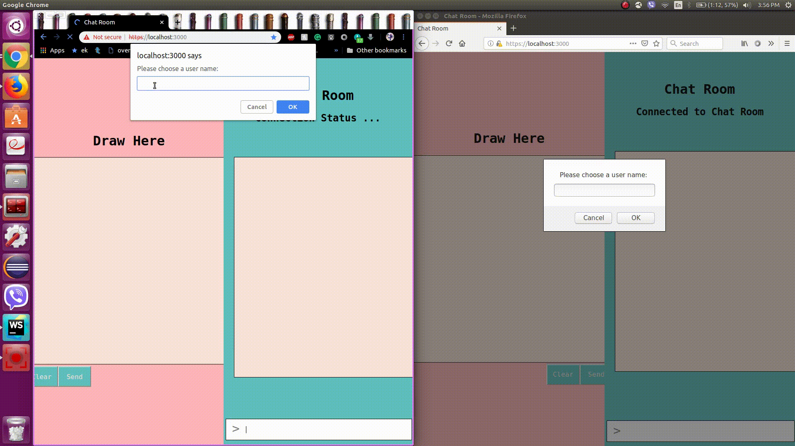

# Drawing Chat program
This chat program was created by Quang Duc (nguyenqu2@grinnell.edu) and Priyanka Dangol (dangolpr@grinnell.edu)
during our Grinnell College Externship 2019 under the mentorship of David Leppik.

We used JavaScript, Node.js, Websockets and Express to deploy a real-time chat program.

The users join chat room with their chosen username. They can send normal text messages or they can draw to the canvas
then send it as an image.

# Instruction:
## 1. Start the server:
```
$ cd Chat-Program
$ node app.js
```
These commands start the server at some port, for example, the terminal will have prompt:
```
Listening on 3000
```
In this case the port is 3000. 

## 2. Join the room:
In browser, navigate to host IP address with corresponding port. Such as:

[https://localhost:3000]

User will be prompted to enter a username and start chatting. That's it!

# Demo



